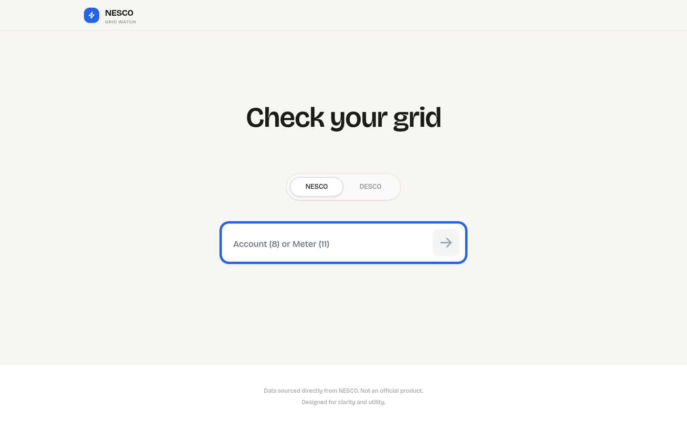
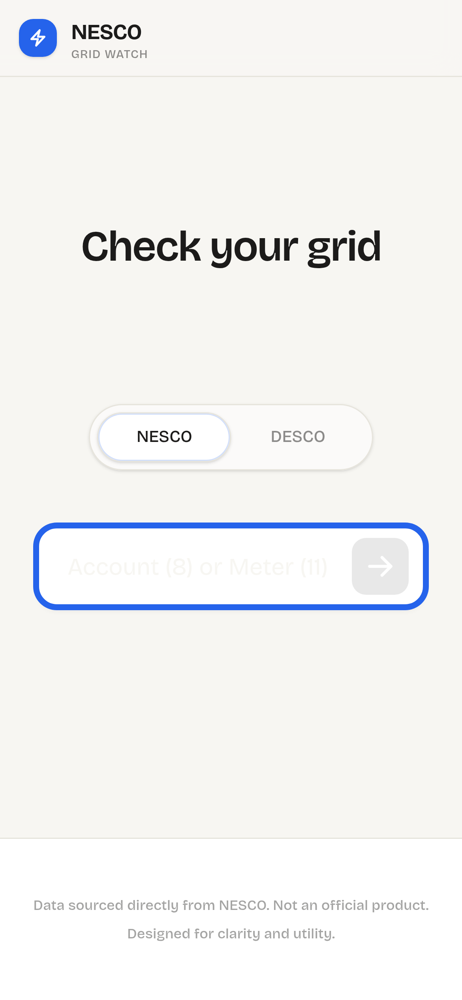
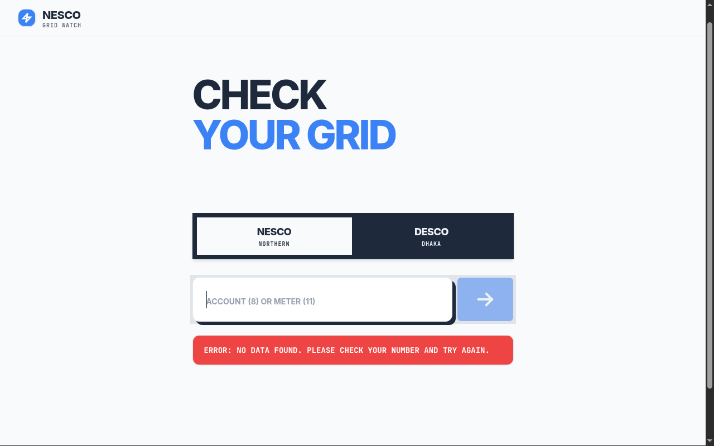
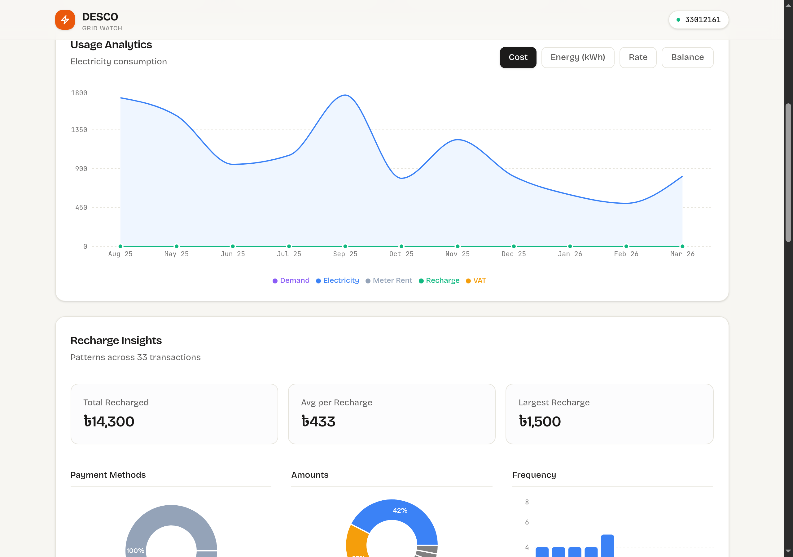

# BD Meter — NESCO & DESCO Prepaid Dashboard

A lightweight PWA for checking prepaid electricity meter data from **NESCO** and **DESCO** in Bangladesh. Enter your account or meter number to see your balance, recharge history, monthly usage analytics, and charts — all in one place.

Built with React + Netlify Functions. Includes Telegram, WhatsApp, and Discord bot integrations for checking your meter from chat.

## Live URL

**https://bdmeter.netlify.app/**

## Install as App (Add to Home Screen)

BD Meter is a Progressive Web App (PWA). You can install it on your phone or desktop and use it like a native app — no app store needed.

### Android (Chrome)

1. Open **https://bdmeter.netlify.app/** in Chrome
2. Tap the **three-dot menu** (top right)
3. Tap **"Add to Home screen"** or **"Install app"**
4. Tap **Install** in the prompt
5. The app icon appears on your home screen

### iPhone / iPad (Safari)

1. Open **https://bdmeter.netlify.app/** in Safari
2. Tap the **Share** button (square with arrow)
3. Scroll down and tap **"Add to Home Screen"**
4. Tap **Add**
5. The app icon appears on your home screen

### Desktop (Chrome / Edge)

1. Open **https://bdmeter.netlify.app/**
2. Click the **install icon** in the address bar (or use the browser menu)
3. Click **Install**

Once installed, the app opens in its own window without browser UI, and works offline for cached pages.

## Screenshots

### Landing (Desktop)


### Landing (Mobile)


### Dashboard (Customer Info, Stats & Charts)


### Dashboard (Usage Chart & Recharge Insights)


## Features

- **Provider switch** — toggle between NESCO and DESCO
- **Input validation** — validates by provider-specific number lengths (NESCO: 8 or 11 digits, DESCO: 8-9 or 11-12 digits)
- **Customer info** — name, address, tariff, load, meter type, status, office, feeder
- **Balance at a glance** — current balance, last recharge, month-over-month change
- **Recharge history** — full transaction table with PIN copy helper for failed remote recharges (NESCO)
- **Recharge insights** — payment method breakdown, auto-apply success rate, recharge frequency charts
- **Monthly breakdown** — detailed cost/usage table with horizontal scroll on small screens
- **Usage charts** — interactive charts for cost, energy (kWh), rate (BDT/kWh), and balance trends (Recharts)
- **Saved meters** — local saved meter profiles with primary meter support (auto-loads on open)
- **PWA** — installable on Android, iOS, and desktop; works offline for cached pages
- **Bot integrations** — Telegram, WhatsApp, and Discord bots for checking meter data from chat

## Stack

| Layer | Technology |
|-------|-----------|
| Frontend | React 19 + Vite 8 + Tailwind CSS 4 |
| Charts | Recharts |
| Backend/API | Netlify Functions (`netlify/functions/*.mjs`) |
| HTML scraping | Cheerio (for NESCO) |
| Bot user storage | `@netlify/blobs` |

## Project Structure

```
src/
  components/
    MeterInput.jsx     # Landing page with provider toggle and meter input
    Dashboard.jsx      # Dashboard shell (loads all sub-components)
    CustomerInfo.jsx   # Customer details grid
    StatsCards.jsx     # Balance, last recharge, usage, cost/kWh cards
    UsageChart.jsx     # Interactive multi-view usage charts
    RechargeInsights.jsx # Payment method, success rate, frequency charts
    RechargeHistory.jsx  # Full recharge transaction table
    MonthlyTable.jsx   # Monthly cost/usage breakdown table
  hooks/
    useMeters.js       # Local storage meter state management
  App.jsx              # App shell, fetch flow, routing

netlify/functions/
  nesco.mjs            # NESCO scraper API (Cheerio-based)
  desco.mjs            # DESCO API adapter
  telegram.mjs         # Telegram bot webhook
  whatsapp.mjs         # WhatsApp bot webhook
  discord.mjs          # Discord interaction endpoint

public/
  manifest.json        # PWA manifest
  sw.js                # Service worker for offline caching
  favicon.svg          # App icon (SVG)
  icon-192.png         # PWA icon 192x192
  icon-512.png         # PWA icon 512x512
  apple-touch-icon.png # iOS home screen icon
```

## Local Development

1. Install dependencies:

```bash
npm install
```

2. Frontend-only dev (no serverless APIs):

```bash
npm run dev
```

3. Full app dev with Netlify Functions:

```bash
netlify dev
```

This serves through `http://localhost:8888` and proxies the Vite app + `/api/*` functions together.

## Build & Quality

```bash
npm run lint
npm run build
```

## API Endpoints

| Endpoint | Description |
|----------|-------------|
| `GET /api/nesco?meter=<number>` | Fetch NESCO meter data |
| `GET /api/desco?account=<number>&meter=<number>` | Fetch DESCO meter data |
| `POST /api/telegram` | Telegram bot webhook |
| `POST /api/whatsapp` | WhatsApp bot webhook (also handles GET for verification) |
| `POST /api/discord` | Discord interaction endpoint |

## Self-Hosting

You can deploy your own instance on Netlify (free tier works fine).

### 1. Deploy to Netlify

```bash
# Fork or clone the repo
git clone https://github.com/your-username/nesco.git
cd nesco
npm install

# Deploy with Netlify CLI
npm install -g netlify-cli
netlify init
netlify deploy --prod
```

Or connect the repo directly from the [Netlify dashboard](https://app.netlify.com/) — it will auto-build on push.

### 2. Set Up Bot Integrations (Optional)

The web dashboard works out of the box with no environment variables. Bot integrations are optional and require the following setup:

#### Telegram Bot

1. Create a bot with [@BotFather](https://t.me/BotFather) on Telegram
2. Copy the bot token
3. Set the environment variable in Netlify:
   - `TELEGRAM_BOT_TOKEN` — your bot token from BotFather
4. Set the webhook URL:
   ```
   https://api.telegram.org/bot<YOUR_TOKEN>/setWebhook?url=https://your-site.netlify.app/api/telegram
   ```

**Telegram bot commands:**
| Command | Description |
|---------|-------------|
| `/help` | Show all commands |
| `/check [number]` | Full meter report (uses primary if no number given) |
| `/balance [number]` | Quick balance check |
| `/token [number]` or `/pin [number]` | Last recharge PIN/token |
| `/provider nesco\|desco` | Set default provider |
| `/save <number>` | Save a meter |
| `/primary <number>` | Set primary meter |
| `/meters` or `/list` | List saved meters |
| `/remove <number>` | Remove a saved meter |

Or just send a meter/account number directly (8-12 digits).

#### WhatsApp Bot

1. Create a [Meta Developer App](https://developers.facebook.com/) with WhatsApp product
2. Set up a WhatsApp Business account and phone number
3. Set these environment variables in Netlify:
   - `WHATSAPP_TOKEN` — permanent access token from Meta
   - `WHATSAPP_PHONE_NUMBER_ID` — your phone number ID from Meta dashboard
   - `WHATSAPP_VERIFY_TOKEN` — any string you choose (default: `nesco-verify`)
4. Set the webhook URL in Meta dashboard to `https://your-site.netlify.app/api/whatsapp`
5. Subscribe to the `messages` webhook field

**WhatsApp bot commands:**
| Command | Description |
|---------|-------------|
| `help` (or `hi`, `hello`, `start`, `menu`) | Show all commands |
| `check [number]` | Full meter report |
| `balance [number]` | Quick balance check |
| `token [number]` or `pin [number]` | Last recharge PIN/token |
| `provider nesco\|desco` | Set default provider |
| `save <number>` | Save a meter |
| `primary <number>` | Set primary meter |
| `meters` or `list` | List saved meters |
| `remove <number>` | Remove a saved meter |

Or just send a meter/account number directly (8-12 digits).

#### Discord Bot

1. Create a [Discord Application](https://discord.com/developers/applications)
2. Add a bot to your application
3. Set the **Interactions Endpoint URL** to `https://your-site.netlify.app/api/discord`
4. Register slash commands — use the built-in registration endpoint:

```
GET https://your-site.netlify.app/api/discord?register=true&app_id=<APP_ID>&bot_token=<BOT_TOKEN>
```

This auto-registers all 10 slash commands (`/help`, `/check`, `/balance`, `/token`, `/pin`, `/provider`, `/save`, `/primary`, `/meters`, `/remove`). You only need to run this once.

5. Invite the bot to your server with the `applications.commands` scope

All bot integrations store user preferences (saved meters, primary meter, default provider) in `@netlify/blobs`, scoped per platform.

## Environment Variables

| Variable | Required | Description |
|----------|----------|-------------|
| `TELEGRAM_BOT_TOKEN` | For Telegram bot | Bot token from @BotFather |
| `WHATSAPP_TOKEN` | For WhatsApp bot | Meta permanent access token |
| `WHATSAPP_PHONE_NUMBER_ID` | For WhatsApp bot | Phone number ID from Meta dashboard |
| `WHATSAPP_VERIFY_TOKEN` | For WhatsApp bot | Webhook verification token (default: `nesco-verify`) |
| `URL` | No | Override the public site URL used in bot messages |

Set these in **Netlify > Site settings > Environment variables**.

## Notes

- This is not an official NESCO or DESCO product.
- Data availability/shape depends on upstream provider responses.
- The NESCO scraper parses HTML from `customer.nesco.gov.bd` using Cheerio.
- The DESCO adapter calls the DESCO prepaid API at `prepaid.desco.org.bd`.
