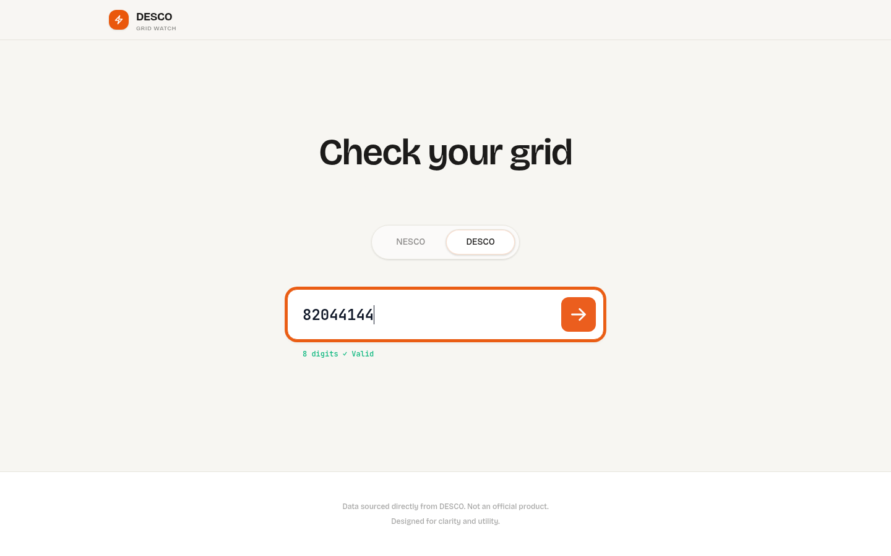

# NESCO / DESCO Prepaid Meter Dashboard

A React + Netlify Functions app for checking prepaid electricity meter data from:

- `NESCO` (8-digit account or 11-digit meter)
- `DESCO` (8-9 digit account or 11-12 digit meter)

The UI includes recharge history, monthly usage analytics, charts, and reusable saved meter profiles.

## Live URL

https://bdmeter.netlify.app/

## Screenshots

### Landing (Desktop)


### Landing (Mobile)


### Dashboard (Data View)


### DESCO Input State


## Features

- Provider switch: `NESCO` and `DESCO`
- Input validation by provider-specific number lengths
- Recharge history with PIN copy helper for failed remote recharges
- Monthly breakdown table with horizontal scroll on small screens
- Usage charts (Recharts)
- Local saved meter profiles with primary meter support
- Serverless data fetch/parsing through Netlify Functions
- Optional bot/webhook endpoints for Telegram, WhatsApp, and Discord flows

## Stack

- Frontend: React 19 + Vite 8 + Tailwind CSS 4
- Charts: Recharts
- Backend/API: Netlify Functions (`netlify/functions/*.mjs`)
- HTML scraping/parsing: Cheerio (for NESCO)
- Persistence for bot users: `@netlify/blobs`

## Project Structure

```txt
src/
  components/      # UI blocks (dashboard cards, charts, tables, forms)
  hooks/           # local storage meter state
  App.jsx          # app shell + fetch flow

netlify/functions/
  nesco.mjs        # NESCO scraper API
  desco.mjs        # DESCO API adapter
  telegram.mjs     # Telegram bot webhook
  whatsapp.mjs     # WhatsApp webhook
  discord.mjs      # Discord interaction endpoint
```

## Local Development

1. Install dependencies:

```bash
npm install
```

2. Frontend-only dev (no serverless APIs):

```bash
npm run dev
```

3. Full app dev with Netlify Functions:

```bash
netlify dev
```

By default this serves through `http://localhost:8888` and proxies the Vite app + `/api/*` functions together.

## Build & Quality

```bash
npm run lint
npm run build
```

## API Endpoints

- `GET /api/nesco?meter=<number>`
- `GET /api/desco?account=<number>&meter=<number>`

Bot/webhook endpoints:

- `/api/telegram`
- `/api/whatsapp`
- `/api/discord`

## Environment Variables

Set these in Netlify when using bot integrations:

- `TELEGRAM_BOT_TOKEN`
- `WHATSAPP_VERIFY_TOKEN`
- `WHATSAPP_TOKEN`
- `WHATSAPP_PHONE_NUMBER_ID`

`URL` can also be set to override the public site URL used by bot messages.

## Notes

- This is not an official NESCO or DESCO product.
- Data availability/shape depends on upstream provider responses.
